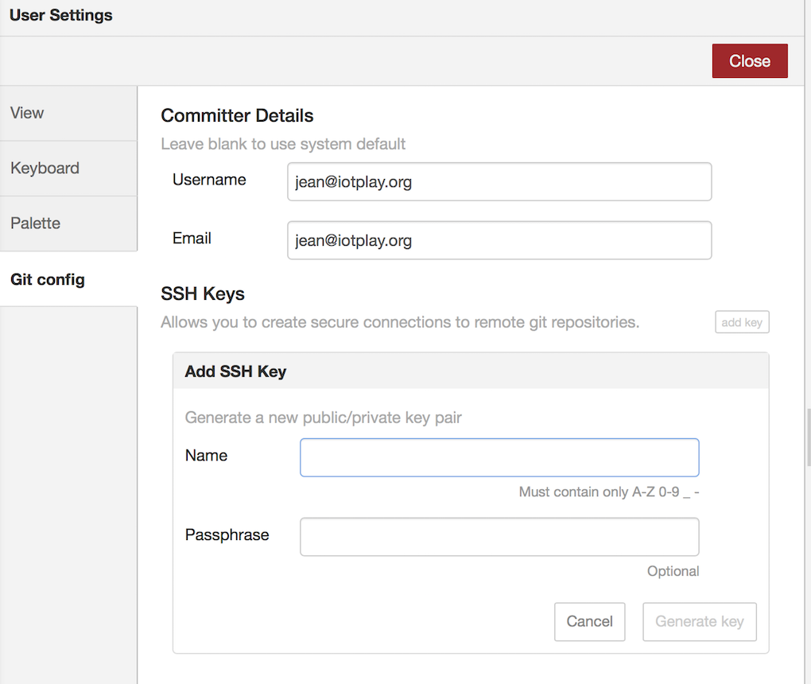
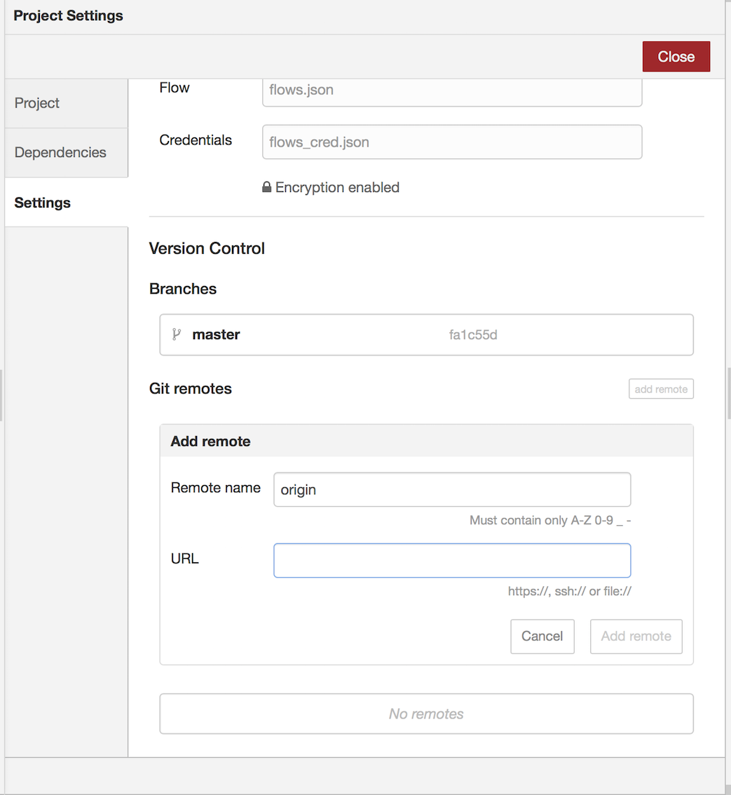
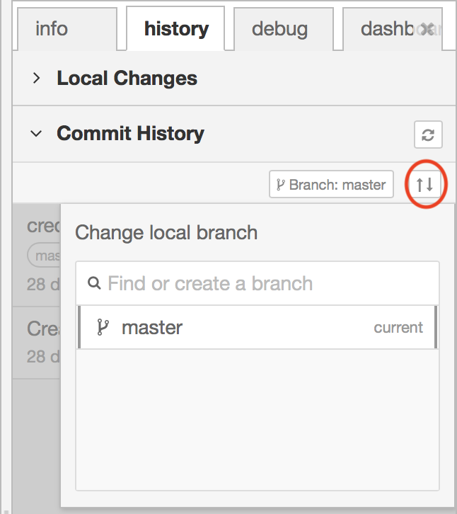
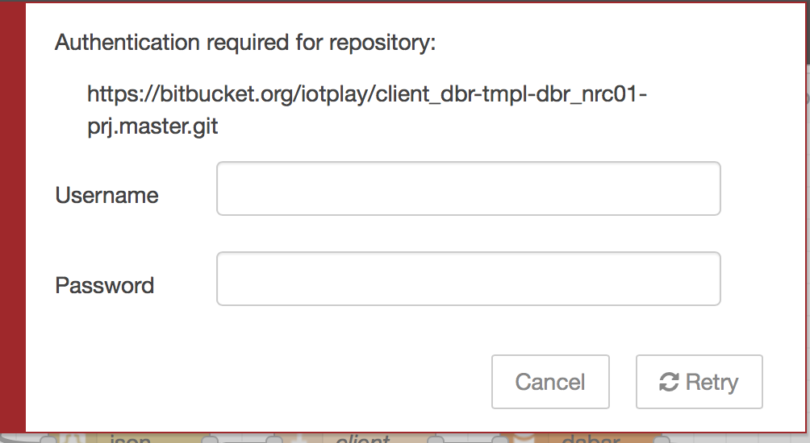
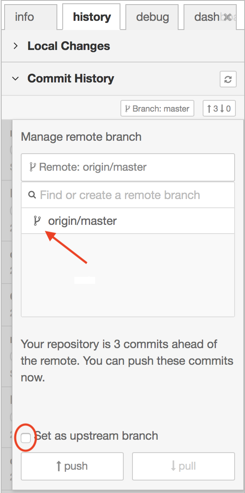
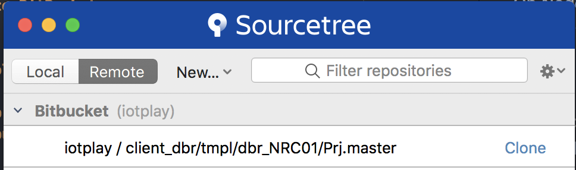
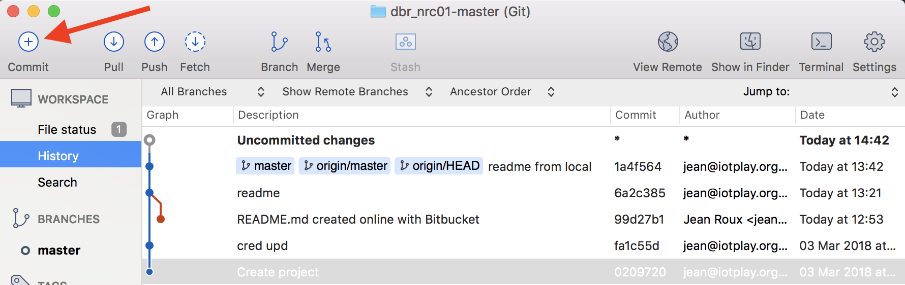

## Working with NodeRed Projects AND remote repos

### Introduction

The new feature since NodeRed v0.18.3 Projects has lots of potential, for building NodeRed templates for multiple deploy, such as in the dabar case where many clients industrial water use are displayed in their own web client, but the NodeRed flows are the same.  

Herewith steps to configure it for the following use case:  
- Develop on NodeRed, (on docker on Mac);  
- Commit changes in a NodeRed 'Project' to local git under NodeRed;  
- then to do a remote commit to git on bitbucket (you can have private repo's, unlike on github, but any git repo will work);  
- and lastly to use Ansible to deploy the runtime, and a bash script to unpack the NodeRed code to the folders of each of the clients.  

In this example, we will start with local NodeRed flows which have lready been developed, create the remote rpos, and pushing these to the remote.

#### Links to useful info on Projects, and Bitbucket

- NodeRed Projects feature - [NodeRed docs](https://nodered.org/docs/user-guide/projects/)
- Setting up bitbucket ssh public key - [Atlasian](https://confluence.atlassian.com/bbkb/permission-denied-publickey-302811860.html)

#### Steps in the ReadMe:
- Step 1: Create NodeRed keys for remote repos
- Step 2: Prepare the localhost ssh keys for use in steps 7 - SourceTree clone
- Step 3: Configure a remote repo on Bitbucket
- Step 4: Configure BitBucket repo
- Step 5: Add the Remote Repo in NodeRed
- Step 6: Commit NodeRed Project to BitBucket
- Step 7: Clone BitBucket repo to local Host
- Step 8: Prepare the ../Git_bitbucket clone to reproduce NodeRed

#### Products used in this readme file

- Docker
- NodeRed
- BitBucket
- SourceTree
- Ansible

## Steps to configure ...  

##### Step 1:  Create NodeRed keys for remote repos

Setup a remote repo key in NodeRed:
- From menu option:  
  `Project Settings > Settings > add remote`  
  'Allows you to create secure connections to remote git repositories.'  
  See **Screen 1: add key** below.  

  Settings, eg.:  
  - Name: `nodered_client_dbr`
  - Passphrase: eight characters   

- In NodeRed, the key are stored in folder:  
  `data/projects/.sshkeys`, with above name, the key names are:
    - __default_nodered_client_dbr
    - __default_nodered_client_dbr.pub  

##### Step 2: Prepare the localhost ssh keys for use in steps 7 - SourceTree clone

- Copy the above SSH keys created to your host .ssh key folder,  
  `cp <localNRfolder>/data/projects/.sshkeys/*.* ~/.ssh`  

- Load this ssh identity on the local host with command ssh-add ~/.ssh/<identity>:
  `ssh-add ~/.ssh/<identity> `. For this example command below, it will sk you for the passphrase you used in `Step 1`:  

  `ssh-add ~/.ssh/__default_nodered_client_dbr`

- Test if the identity loaded with `ssh-add -l`.

##### Step 3: Configure a remote repo on Bitbucket  

Create yourself a user on Bitbucket, in this example's case, the user is `iotplay`.

If, for instance, for the client `client_dbr`, the local NodeRed `template` folder, for the client template NodeRed flows `NRC01` with a project name `master`, the repo name on bitbucket should be:  

`/client_dbr/tmpl/dbr_NRC01/Prj.master`

Create a new Repository in Bitbucket with this name.

##### Step 4: Configure BitBucket repo for xxx

- On the local host, get the public key in the clipboard:  
  `cat ~/.ssh/__default_nodered_client_dbr.pub | pbcopy`  

- ***SSH Keys***. In BitBucket, click on your Avatar, (left bottom) go to Bitbucket settings > in Security section - SSH keys > Add key.  
  - *Label*:  `__default_nodered_client_dbr`
  - *Key*: paste the public key from the clipboard  

- In the BitBucket Repo, initiate the repo, by for instance creating the default `readme.md` under the `Source` menu option, and commit it.  

- Get the https link to the repo under menu option `Overview`. For the example used, it is:
  `https://iotplay@bitbucket.org/iotplay/client_dbr-tmpl-dbr_nrc01-prj.master.git`

##### Step 5: Add the Remote Repo in NodeRed

On NodeRed, menu `Project Settings > Settings > add remote` use the above url from Overview on Bitbucket, minus the username, add to `URL` on Screen 2: add remote (see below). Thus:  

>URL: `https://bitbucket.org/iotplay/client_dbr-tmpl-dbr_nrc01-prj.master.git`, and hit `Add  Remote` button.

##### Step 6: Commit NodeRed Project to BitBucket  

Setup the remote branch:  
- See screen 3 below, on menu: `Control Panel > history tab > Commit History`;  
- Click on the up/down arrows;  
- A screen, see `Screen 4` will pop up, under 'Authentication required for repository:', add the Username and Password of your Bitbucket account.

Replicate the local NodeRed flows to the Remote:
  - Some conflicts might show up if you have a local readme.md already, solve these.
  - Choose the origin/mast as branch, tick the `set as upstrem master`, and hit `push` button to clone to remote.

Confirm that the files reached the bitbucket, by viewing 'source' menu option under the Repo.  

##### Step 7: Clone BitBucket repo to local Host

Once your SourceTree  [download SourceTree here](https://www.sourcetreeapp.com) is setup to read your BitBucket user, you can clone it to the local Mac, to for instance add folders (BitBucket cannot add folders otherwise)

- Clone to local with SourceTree app, button `clone`, see `Screen 6`.
- Choose local folder, in this example, I chose:  
  `~/Git_bitbucket/client_dbr/tmpl/dbr_nrc01/data/projects/master/`  
- whilst I ensured the name is `dbr_nrc01-master`.  

##### Step 8: Prepare the ../Git_bitbucket clone to reproduce NodeRed

In order to prepare the clone to be used on a target host where NodeRed are to be started, some steps are required.   

Like getting the `settings.js` file into the repo. A good place to put files, is in a sub-folder to the cloned folder, then it will be cloned as well, I chose `setup`.

- Go to the local cloned folder on your host in `Step 7` above, and add a folder `setup`
- From the NodeRed server, under `/data`, copy `settings.js` into the `setup` folder.
- In the SourceTree cloned copy screen, hit commit button, see `Screen 7`.
- On the next screen, choose the settings.js file, give a reason in the commit box at the bottom, I chose 'setup files added', and hit the `Commit` button.
- If you now go back to Bitbucket, under the Source menu of the Repo, you will find the folder, and file/s cloned to it.

### Screens used in Above examples

- NodeRed:

  - **Screen 1: add key**  
  menu: Settings > Git config > add key :  

        
      .

  - **Screen 2: add remote**  
    menu: Project Settings > Settings > add remote :   

        
      .

  - **Screen 3: Commit to Remote**  
    menu: Control Panel > history tab > Commit History  

        
      .  

  - **Screen 4: Authentication required**  

        
      .  

  - **Screen 5: Authentication required**  

        
      .  

  - **Screen 6: Clone in SourceTree**  

        
      .  

  - **Screen 7: Commit in SourceTree**  

        
      .  
