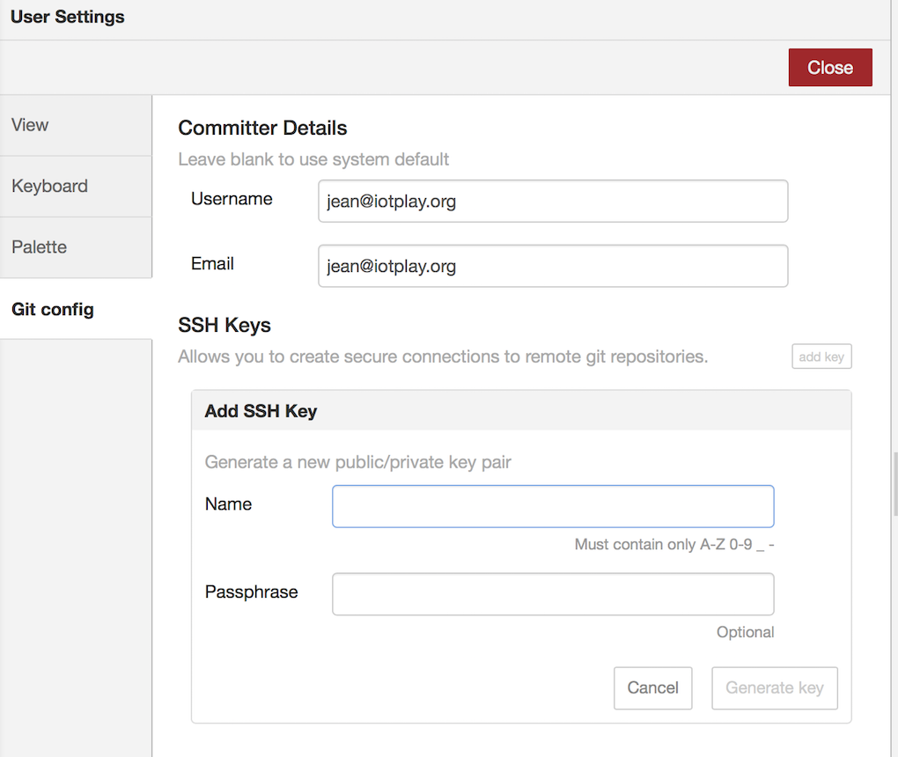
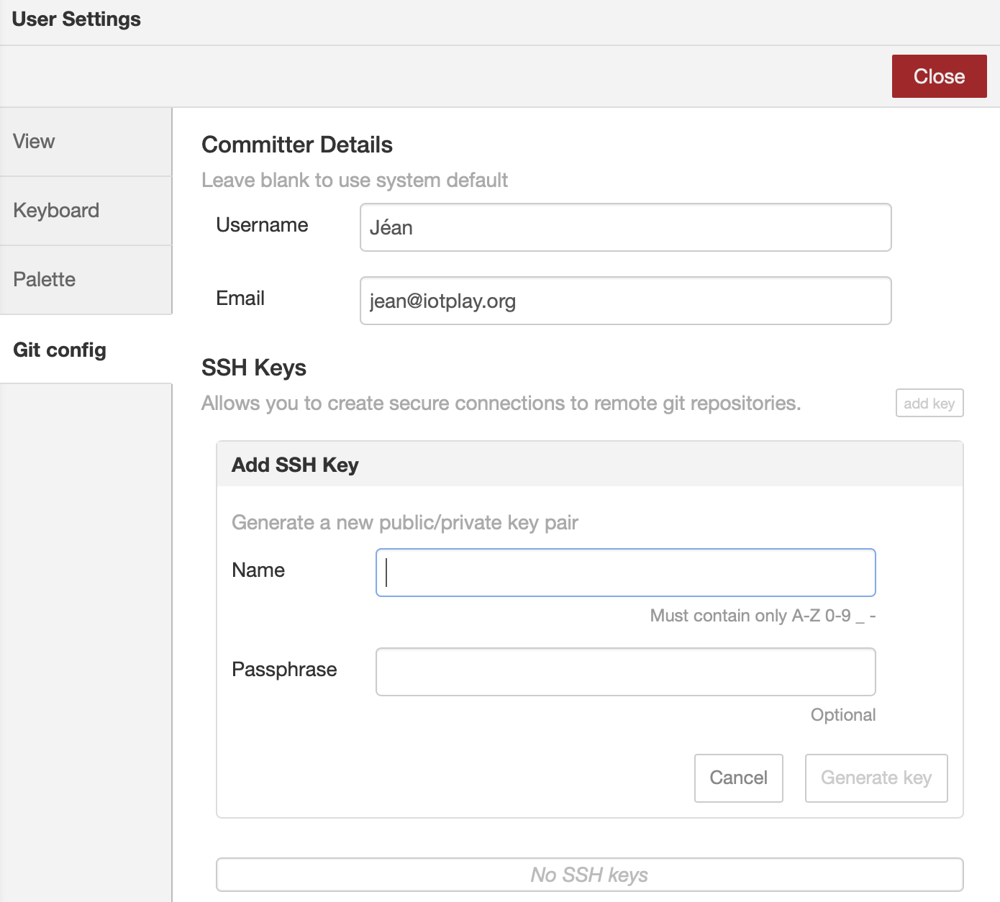
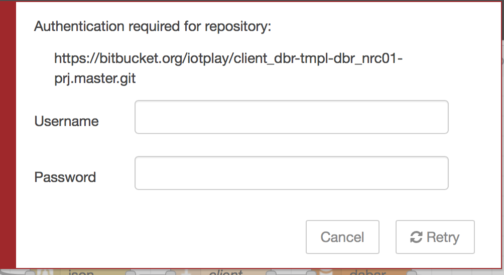
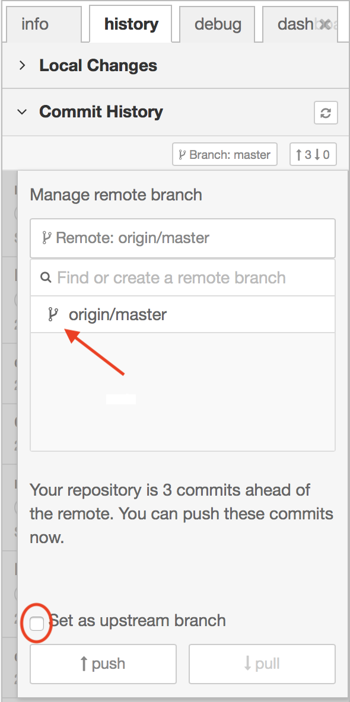
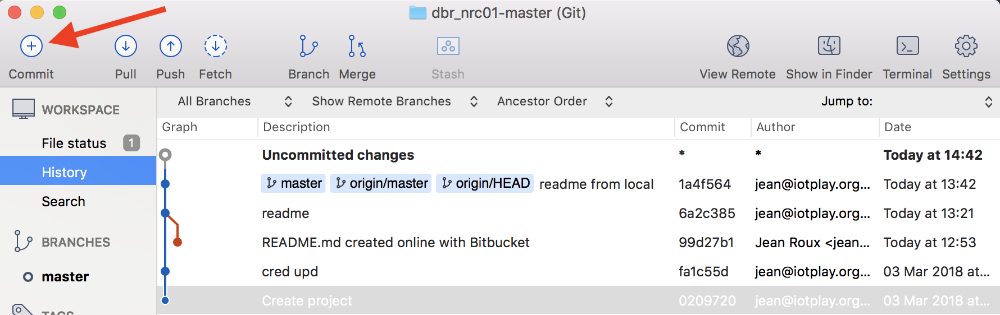
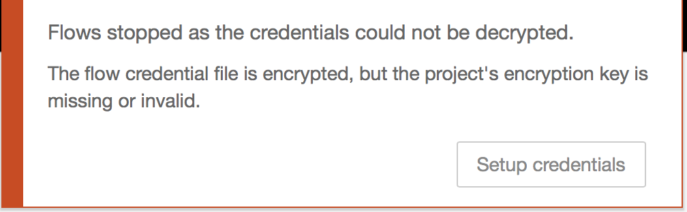
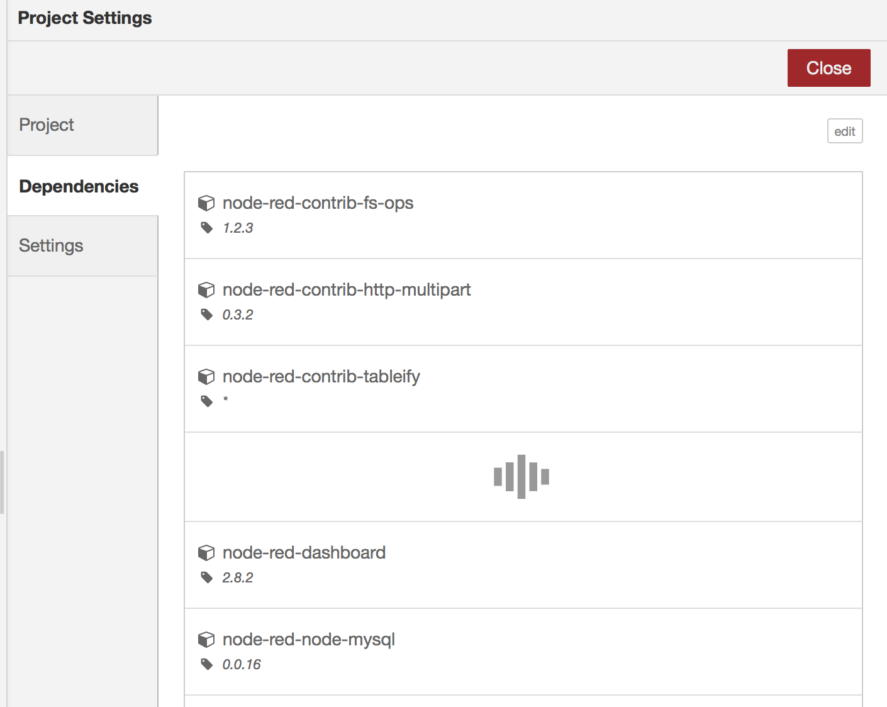

# Working with Node-RED Projects AND remote repos

---> Back to the README file with the [Table of Contents](../README.md).

## Introduction

The new feature since Node-RED v0.18.3 Projects has lots of potential, for building Node-RED templates for multiple deploy, such as in the iotplay case where more-than-one clients' use the same flows.  

Herewith steps to configure it for the following use case:  
- Develop on Node-RED, (on docker on Mac);  
- Commit changes in a Node-RED 'Project' to local git under Node-RED;  
- then to do a remote commit to git on bitbucket (you can have private repo's, unlike on github, but any git repo will work);  
- and lastly to use Ansible to deploy the runtime, and a bash script to unpack the Node-RED code to the folders of each of the clients.  

In this example, we will start with local Node-RED flows which have already been developed, create the remote repository, and pushing these to the remote.

#### Links to useful info on Projects, and Bitbucket

- Node-RED Projects feature - [Node-RED docs](https://nodered.org/docs/user-guide/projects/)
- Setting up bitbucket ssh public key - [Atlasian](https://confluence.atlassian.com/bbkb/permission-denied-publickey-302811860.html)

#### Steps in the ReadMe:
- Step 1: Create Node-RED keys for remote repos
- Step 2: Prepare the localhost ssh keys for use in steps 7 - SourceTree clone
- Step 3: Configure a remote repo on Bitbucket
- Step 4: Configure BitBucket repo
- Step 5: Add the Remote Repo in Node-RED
- Step 6: Commit Node-RED Project to BitBucket
- Step 7: Clone BitBucket repo to local Host
- Step 8: Prepare the ../Git_bitbucket clone to reproduce Node-RED
- Step 9: Use Ansible to clone the repo from BitBucket & Prepare Node-RED runtime
- Step 10: Point local Mac docker instance back to the ~/Git_bitbucket folder
- Step 11: Recreate a Runtime server

#### Products used in this readme file

- Node-RED
- BitBucket
- SourceTree
- Docker & Ansible (later steps)

#### Assumptions

Several assumptions have been used for this readme:
- You have got Projects up and running, see instructions on [Node-RED docs](https://nodered.org/docs/user-guide/projects/)

---
## Steps to configure ...  

#### Step 1:  Create Node-RED keys for remote repos

If you use Docker to start the Node-RED flows - already got Projects working, start it now, and access the admin client.

Copy the keys from your backup folder, if you have created them before, or carry on below.

Setup a remote repo key in Node-RED:
- From menu option:  
  `Project Settings > Settings > add remote`  
  'Allows you to create secure connections to remote git repositories.'  
  See **Screen 1: add key** below.  

  Settings, eg.:  
  - Name: `nodered_client_dbr`
  - Passphrase: eight characters   


- In Node-RED, the key are stored in folder:  
  `data/projects/.sshkeys`, with above name, the key names are:
    - default_Node-RED_client_dbr
    - default_Node-RED_client_dbr.pub  

#### Step 2: Prepare the localhost ssh keys for use in steps 7 - SourceTree clone

- Copy the above SSH keys created to your host .ssh key folder,  
  `cp <localNRfolder>/data/projects/.sshkeys/*.* ~/.ssh`  

- Load this ssh identity on the local host with command ssh-add ~/.ssh/<identity>:
  `ssh-add ~/.ssh/<identity> `. For this example command below, it will sk you for the passphrase you used in `Step 1`:  

  `ssh-add ~/.ssh/__default_nodered_client_dbr`

- Test if the identity loaded with `ssh-add -l`.


#### Step 3: Configure a remote repo on Bitbucket  

Create yourself a user on Bitbucket, in this example's case, the user is `iotplay`.

If, for instance, for the client `client_dbr`, the local Node-RED `template` folder, for the client template Node-RED flows `NRC01` with a project name `master`, the repo name on bitbucket should be:  

`/client_dbr/tmpl/dbr_NRC01/Prj.master`

Create a new Repository in Bitbucket with this name.

#### Step 4: Configure BitBucket repo for xxx

- On the local host, get the public key in the clipboard:  
  `cat ~/.ssh/__default_nodered_client_dbr.pub | pbcopy`  

- ***SSH Keys***. In BitBucket, click on your Avatar, (left bottom) go to Bitbucket settings > in Security section - SSH keys > Add key.  
  - *Label*:  `__default_nodered_client_dbr`
  - *Key*: paste the public key from the clipboard  


- In the BitBucket Repo, initiate the repo, by for instance creating the default `readme.md` under the `Source` menu option, and commit it.  

- Get the https link to the repo under menu option `Overview`. For the example used, it is:
  `https://iotplay@bitbucket.org/iotplay/client_dbr-tmpl-dbr_nrc01-prj.master.git`


#### Step 5: Add the Remote Repo in Node-RED

On Node-RED, menu `Project Settings > Settings > add remote` use the above url from Overview on Bitbucket, minus the username, add to `URL` on Screen 2: add remote (see below). Thus:  

>URL: `https://bitbucket.org/iotplay/client_dbr-tmpl-dbr_nrc01-prj.master.git`, and hit `Add  Remote` button.

#### Step 6: Commit Node-RED Project to BitBucket  

Setup the remote branch:  
- See screen 3 below, on menu: `Control Panel > history tab > Commit History`;  
- Click on the up/down arrows;  
- A screen, see `Screen 4` will pop up, under 'Authentication required for repository:', add the Username and Password of your Bitbucket account.

Replicate the local Node-RED flows to the Remote:
  - Some conflicts might show up if you have a local readme.md already, solve these.
  - Choose the origin/mast as branch, tick the `set as upstrem master`, and hit `push` button to clone to remote.

Confirm that the files reached the bitbucket, by viewing 'source' menu option under the Repo.  

#### Step 7: Clone BitBucket repo to local Host

Once your SourceTree  [download SourceTree here](https://www.sourcetreeapp.com) is setup to read your BitBucket user, you can clone it to the local Mac, to for instance add folders (BitBucket cannot add folders otherwise)

- Clone to local with SourceTree app, button `clone`, see `Screen 6`.
- Choose local folder, in this example, I chose:  
  `~/Git_bitbucket/client_dbr/tmpl/dbr_nrc01/data/projects/master/`  
- whilst I ensured the name is `dbr_nrc01-master`.  

#### Step 8: Prepare the ~/Git_bitbucket clone to reproduce Node-RED on Runtime host

In order to prepare the clone to be used on a target host where Node-RED are to be started, some steps are required.   

Like getting the `settings.js` file into the repo. A good place to put files, is in a sub-folder to the cloned folder, then it will be cloned as well, I chose `setup`.

- Go to the local cloned folder on your host in `Step 7` above, and add a folder `setup`
- From the Node-RED server, under `/data`, copy `settings.js` into the `setup` folder.
- In the SourceTree cloned copy screen, hit commit button, see `Screen 7`.
- On the next screen, choose the settings.js file, give a reason in the commit box at the bottom, I chose 'setup files added', and hit the `Commit` button.
- If you now go back to Bitbucket, under the Source menu of the Repo, you will find the folder, and file/s cloned to it.

Now you are ready for cloning the Repo to a production host, and copying this template files, like `flows.json` and other files to Docker instances.  

#### Step 9: Use Ansible to clone the repo from BitBucket & Prepare Node-RED runtime
In this step, you can clone the runtime back to the Mac, or another host to test how it will run. I use the standard folder `~/dockerapps/`. Steps to do in Ansible:

- git clone this repo to the target host under `~/.tmp/dbr_nrc01`
- Create the runtime directory, `~/dockerapps/dbr_nrc01/data`
- Copy the Node-RED files with Ansible from the `.tmp/dbr_nrc01` folder:

  - `settings.js` --> `~/dockerapps/dbr_nrc01/data`
  - `flows.json`  --> `~/dockerapps/dbr_nrc01/data/projects/master/`
  - same for other files required for Node-RED.

#### Step 10: Point local Mac docker instance back to the ~/Git_bitbucket folder
Now that all files required to start-up the Node-RED files from the ~/Git_bitbucket folder, the `Dockerfile` used to startup the Mac Node-RED docker instance for `dbr_NRC01` can be pointed to the newly cloned folder.

I have not tested this yet, but this is the next step I will test.

#### Step 11: Recreate a Runtime server
As above, you can recreate a new runtime server from the bitbucket git clone. Rough steps (to be reworked still):  

##### Through cloning & restoring all
1. git clone the dbr_images repo into  dockerapps/
2. git clone from bitbucket into target host of the repo nrp101 to dockerapps/nrp101/data/projects/master
3. create directory dockerapps/nrp101/data/projects/.sshkeys
4. add back the keys that was created, `__default_client_dbr_NR` and the .pub (thus save it, and get it back !)
5. copy the settings.js from the repo (which we put their to use it) to /data
6. copy the .config.json back to /data (thus save it, and get it back ! - maybe also into the repo?)
7. None of this will automatically restore the /data/node_modules as required by the /data/projects/master/package.json file, thus open the NR website /admin, and load the missing modules, see `screen 9`

'- or -'
##### Via fresh new project, then add files from cloning back
1. Start a fresh server, with the Projects option in the settings.js file
2. Migrate to projects, master project
3. After cloning to maybe master02 folder, copy into /projects/master the `flow.json, flow_cred.json, package.json`, move `settings.js` into /data
4. Recreate linkup to remote, recreate ssh keys, re-apply to bitbucket.

So, in summary the files to be recreated for the runtime server, and location - which will be mapped to the docker container's volume:
```
- /data/settings.js
- /data/projects/master/.git          ...(& the repo's .git sub-dirs)
- /data/projects/master/flow.json
- /data/projects/master/flow_cred.json
- /data/projects/master/package.json
- /data/projects/.sshkeys/__default_client_dbr_NR
- /data/projects/.sshkeys/__default_client_dbr_NR.pub
```

---
## Issues

During the process I ran into several issues, here are the solutions.

#### Node-RED:  

1. **Issue 1: When credentials not sorted** - when Node-RED starts, See Screen 8.

    **Solution 1: Dealing with credentials**

    - [Node-RED wiki](https://github.com/nodered/nodered/wiki/Design%3A-Encryption-of-credentials)  
    - [Stack overflow](https://stackoverflow.com/questions/48270905/nodered-node-credentials) by Nick O'Leary.

  Here are the steps you need to resolve this:

    - edit your settings.js file and add a credentialSecret property with a whatever string value you want. If you want to disable encryption, set its value to false.  
      `credentialSecret: "my-random-string"`
    - Restart Node-RED and deploy a change - this will trigger Node-RED to re-encrypt your credentials with your chosen key (or disabling encryption if set to false).
    - You can then copy your flow/credential file to a second instance, just make sure you give it the same credentialSecret value in its settings file.  


2. **Issue 2: Using Projects or not on Runtime server**. I thought it would be a workable solution to do the Projects-type setup on the Mac, and without Projects on the Runtime server. One can do this with 2 different `settings.js` files.

  **Solution 2: Projects on runtime server.** After experimenting with this, it seams it is best to use Projects on the Runtime server as well, (for now - until the runtime feature is available on NR). Reasons are:  

  - With Projects, one can add packages required in packages.json, and does not need to do this at Container creation stage.
  - Thus, `Projects` - and the file structure - on the Runtime server as well.

#### SourceTree (in sync with BitBucket)

1. **Issue 1: Credentials issues when SourceTree pushes to Bitbucket**. When sync stops, and the error box reports the below:

  ```
  Pushing to git@bitbucket.org:iotplay/client_dbr-tmpl-dbr_nrp01-prj.master.git
  git@bitbucket.org: Permission denied (publickey).
  fatal: Could not read from remote repository.

  Please make sure you have the correct access rights
  and the repository exists.
  Pushing to git@bitbucket.org:iotplay/client_dbr-tmpl-dbr_nrp01-prj.master.git
  git@bitbucket.org: Permission denied (publickey).
  fatal: Could not read from remote repository.
  ```

  Or, similar:

  ```
  hg clone git@bitbucket.org:iotplay/client_rhm-rhm_nrc01-master.git /Users/jean/Git_bitbucket/client_rhm/rhm_nrc01/master
  abort: repository git@bitbucket.org:iotplay/client_rhm-rhm_nrc01-master.git not found!
  Completed with errors, see above
  ```

  **Solution 1: Step 2**   
  Run `ssh-add ~/.ssh/__default_nodered_client_dbr`.

---
## Screens used in above examples

- Node-RED:

  - **Screen 1: add key**  
  menu: Settings > Git config > add key :  

        
      .

  - **Screen 2: add remote**  
    menu: Project Settings > Settings > add remote :   

        
      .

  - **Screen 3: Commit to Remote**  
    menu: Control Panel > history tab > Commit History  

        
      .  

  - **Screen 4: Authentication required**  

        
      .  

  - **Screen 5: Authentication required**  

        
      .  

- SourceTree:

  - **Screen 6: Clone in SourceTree**  

        
      .  

  - **Screen 7: Commit in SourceTree**  

        
      .  

- Node-RED:

  - **Screen 8: Node-RED - credentials**  

        
      .  
  - **Screen 9: Node-RED - Projects dependencies**

        
      .

---> Back to the README file with the [Table of Contents](../README.md).
